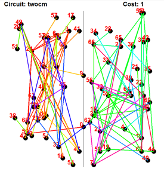
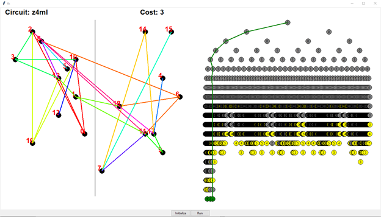
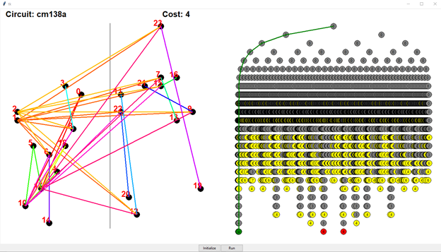

# CPEN 513 – Assignment 3

 

## Introduction

This report describes an implementation of Branch and Bound for bi-partitioning. 

## General Implementation

The application begins by reading the circuit parameters and netlist from the `.txt` file and generating an initial partition and initial cut size. The algorithm then follows `steves_routine` as provided. It proceeds to generate a tree of possible combinations, pruning out any nodes that have greater cut size than the initialized value. At the leaf nodes, the cut size is calculated, and the most optimal partition is kept.

The GUI shows the final partition and the connections between the cells on the left with the circuit name and final cut size. It also shows a diagram of the generated tree on the right side. Green nodes are accepted nodes, red nodes are rejected nodes, yellow nodes are pruned, and a green line shows the path through the tree that generated the final partition. Each node is also labeled with its cut size. A sample image is included as **Appendix A – Sample GUI Output**. When the program is complete, the relevant results and statistics are printed. 

## Optimizations

The resulting cut size is guaranteed to be optimal with branch and bound. However, the overall runtime can be significantly influenced by the quality of the initial partition. Two methods are choosing the initial partition are included and can be configured in `settings.py`.

### Random Initial Partition (Random)

With the `random `setting, the initial partition is randomly generated multiple times. Each cell is randomly placed in either the left or right partition, ensuring that the overall partition is balanced. The partition with the best cut size is selected to be used for pruning.

### Kernighan-Lin (KL)

The Kernighan-Lin algorithm described in class iteratively swaps cells between the partitions. Although this method is not guaranteed to produce the most optimized result, it can quickly generate a good partition. The partition is more likely to have a lower cut size than the random initial partition method and can therefore prune more sections of the branch and bound tree. This can be selected by setting `initial_partition `to `clever `in `settings.py`.

## Results

The resulting cut size and runtime (hours:minutes:seconds) for each benchmark circuit is recorded in Table 1.

Table 1 - Benchmark Results

| **Circuit** | **Cut size** | **Runtime (random)**       | **RUntime (KL)** |
| ----------- | ------------ | -------------------------- | ---------------- |
| cc          | 4            | 4:51:35.864906             | 4:34:59.698272   |
| cm82a       | 1            | 0:00:00.004356             | 0:00:00.002415   |
| cm138a      | 4            | 0:00:00.291801             | 0:00:00.311096   |
| cm150a      | 6            | 0:59:20.787281             | 1:04:30.836588   |
| cm162a      | 6            | 0:03:43.168105             | 0:03:47.634649   |
| con1        | 4            | 0:00:00.102160             | 0:00:00.092946   |
| twocm       | 1            | INCOMPLETE    (> 10 hours) | 6:30:19.544636   |
| ugly8       | 8            | 0:00:00.000558             | 0:00:00.000553   |
| ugly16      | 16           | 0:00:00.001500             | 0:00:00.001557   |
| z4ml        | 3            | 0:00:00.200090             | 0:00:00.160984   |

 

The runtime is longer for KL in some simple circuits because the KL initialization takes a longer time than the randomly generated partitions. In simple circuits, there is a high chance that randomly generate partitions have the same minimized cut size as partitions generated in KL and therefore KL has no advantage. In larger circuits, such as `cc `and `twocm`, this is no longer the case. The time savings of additional pruning can then offset the extra time used to generate the initial partition. 

Another interesting statistic is the number of nodes pruned from the search space in the branch and bound algorithm. This data is included in **Appendix B – Pruned Nodes**. This highlights that the circuits where random initialization performed better did so because the pruning was identical. 

## Application Guide

Run the program with the `gui.py` file. The graphical display is implemented with `tkinter`. The program can be run under single circuit mode or benchmarking mode (controlled by the `single_circuit ` parameter). This and other various parameters can be configured using `settings.py`.

In single circuit mode, the circuit should be set with `circuit_name`. Then, the user can set the initial partition with the **Initialize** button and execute branch and bound with the **Run** button.

·     **Initialize**: Get the initial partition. This action can be repeated to observe possible initial partitions.

·     **Run**: Run branch and bound. This produces the final partition, cut size, and tree structure in the GUI.

In benchmarking mode, all circuits in the `benchmarks/` folder are executed sequentially and the program begins automatically. 

Table 2 outlines the contents of each Python file.

Table 2 - File Descriptions

| **File Name**          | **Purpose**                                                  |
| ---------------------- | ------------------------------------------------------------ |
| `  gui.py  `           | Main file containing  GUI elements and runs the application  |
| ` netlist_parser.py  ` | Parses the circuit  `.txt`  into an appropriate format for the program |
| `util.py  `            | Contains useful  functions shared between algorithms         |
| `  branch_bound.py  `  | Implementation  of the branch and bound algorithm            |
| `settings.py  `        | Contains settings for  the program                           |
| `kernighan_lin.py `    | Implementation  of the Kernighan-Lin algorithm               |

 

## Testing Procedure

Testing for this program was completed manually. The algorithm guarantees identical results for every run, so this criterion is used for testing. The final partition with the best cut-size can be visually checked by setting the `initial_partition ` to `fixed ` and assessing the GUI (shown in Figure 1). The program also maintains a debugging log file that can be manually checked and cross-referenced with the GUI to ensure the program is proceeding correctly. 

Figure 1 - Visual Representation of Final Partition

A few extremely simple netlists were also designed as part of the testing procedure. These netlists are small enough to manually cross-check the cost function and ensure there are no cells missing or connections unaccounted for.

Otherwise, assertions are included throughout the program and exceptions are raised for unexpected results. 

 

 

## Appendix A – Sample GUI Output

 

 

 

 

 

## Appendix B – Pruned Nodes

 

| **Circuit** | **# of Nodes Visited    (random)** | **# of Nodes Visited     (KL)** | **Total Nodes in Full tree** |
| ----------- | ---------------------------------- | ------------------------------- | ---------------------------- |
| cc          | 157451760                          | 146431128                       | 9223372036854775807          |
| cm82a       | 129                                | 87                              | 8191                         |
| cm138a      | 7308                               | 7308                            | 33554431                     |
| cm150a      | 51182866                           | 51182486                        | 137438953471                 |
| cm162a      | 3130191                            | 3026657                         | 274877906943                 |
| con1        | 2939                               | 2939                            | 32767                        |
| twocm       | INCOMPLETE                         | 152790715                       | 2361183241434822606847       |
| ugly8       | 17                                 | 17                              | 511                          |
| ugly16      | 33                                 | 33                              | 131071                       |
| z4ml        | 5288                               | 5252                            | 1048575                      |

 